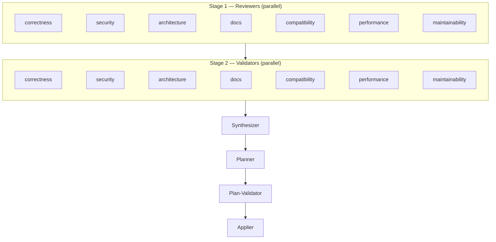
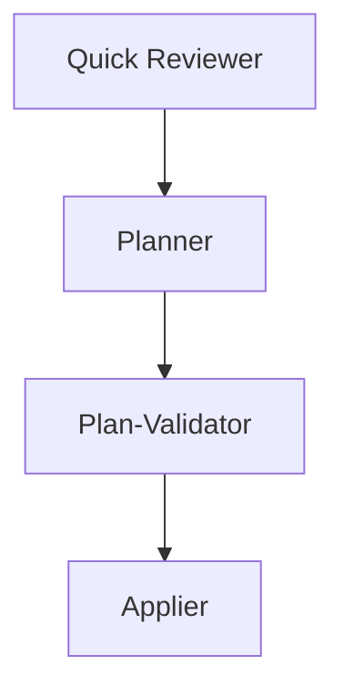

# deepreview

Multi-agent parallel code/spec review for [OpenCode](https://opencode.ai). Spawns 7 specialized
review agents, cross-validates findings, synthesizes results, and produces a
plan-validated, actionable implementation plan.

## Install

Run the setup script:

```bash
bunx @mechanai/deepreview@latest/setup          # Global install (~/.config/opencode/)
bunx @mechanai/deepreview@latest/setup --local   # Project-level install (.opencode/)
```

Or with Node.js (v22+):

```bash
npx --package @mechanai/deepreview@latest deepreview-setup
npx --package @mechanai/deepreview@latest deepreview-setup --local
```

This will:

1. Add `@mechanai/deepreview` to the `plugin` array in your `opencode.json` (creates the file if needed)
2. Symlink agents and commands into the appropriate config directory

> [!NOTE]
> The symlinks are needed because OpenCode does not yet auto-discover
> agents and commands from installed plugin packages.

## Usage

```
/deepreview                   # Review current branch vs main
/deepreview 123               # Review PR #123
/deepreview file1.ts file2.ts # Review specific files
/deepreview --context decisions.md   # Review with design context (suppresses known decisions)
/deepreview --full            # Force the full pipeline (skip auto-detection)

/deepreview-quick             # Abbreviated review (single-pass, 3 subagents)
/deepreview-quick 123         # Abbreviated review of PR #123

/deepreview-loop              # Review + fix loop (repeats until clean or 5 iterations)
/deepreview-loop 123          # Same, targeting a PR
/deepreview-loop --context decisions.md       # Loop with design context
/deepreview-spec-loop --context decisions.md spec.md  # Spec loop with design context

/deepreview-pr-review 123     # Review PR and post findings as a pending GitHub review
/deepreview-pr-review --prior-review findings.md 123  # Include manual prior review
/deepreview-pr-review --no-prior 123                  # Skip auto-fetching prior context from GitHub

/deepreview-spec spec.md                  # Spec-focused review (completeness, consistency, feasibility)
/deepreview-spec --context decisions.md spec.md  # Spec review with design context
/deepreview-spec-loop spec.md             # Spec review + fix loop
```

All commands accept a branch diff, PR number, or file path(s). The `-loop` variants
apply fixes automatically and re-review until no findings remain. Pauses on plateaus
(same finding persists across iterations).

For small diffs (<=8 files, <=500 lines), `/deepreview` automatically uses the abbreviated
path (single-pass reviewer, ~80% fewer tokens). Use `--full` to override.

## Pipeline



Every validator reads all seven reviews (not just the matching one) to cross-check
claims from its assigned perspective. For small diffs, the abbreviated path collapses
Stages 1–2 into a single reviewer:



Stages communicate via files on disk — the orchestrator never reads review content into
its own context, keeping token usage minimal.

## Calibration

deepreview learns from validator severity adjustments over time. When validators
consistently downgrade the same category of finding (e.g., "missing auth" in a
localhost-only tool), the system proposes calibration entries at the end of each
review session.

### How it works

1. **Session end:** The orchestrator compares reviewer severity to synthesized
   (post-validation) severity
2. **Proposal:** Systematic downgrades are proposed as calibration entries
3. **User confirms:** You approve, edit, or reject the proposed changes
4. **Next session:** Approved calibration is injected into reviewer prompts,
   reducing severity inflation

### Configuration

Local calibration (personal, gitignored):

```yaml
# .ai/deepreview/calibration.yml
version: 1
settings:
  expiryDays: 30 # days before unconfirmed entries expire
entries:
  - id: "cal-001"
    pattern: "missing authentication"
    context: "localhost-only server"
    originalSeverity: "warning"
    adjustedSeverity: "suggestion"
    observedCount: 4
    lastConfirmed: "2026-06-28"
    createdAt: "2026-06-01"
```

### Sharing calibration with your team

To share calibration entries, add them to `.deepreview.yml` under the `calibration:` key:

```yaml
# .deepreview.yml
threatModel: localhost-only
calibration:
  settings:
    expiryDays: 60
  entries:
    - id: "shared-001"
      pattern: "missing authentication"
      context: "localhost-only server"
      originalSeverity: "warning"
      adjustedSeverity: "suggestion"
      observedCount: 4
      lastConfirmed: "2026-06-28"
      createdAt: "2026-06-01"
```

Local entries override shared entries when both match the same `pattern` + `context`.

### Review agents

| Agent                       | Code review                            | Spec review                                  |
| --------------------------- | -------------------------------------- | -------------------------------------------- |
| correctness / completeness  | Logic bugs, edge cases, error handling | Gaps, missing edge cases, undefined behavior |
| security / consistency      | Vulnerabilities, threat vectors        | Contradictions, name mismatches, type drift  |
| architecture                | Patterns, coupling, complexity         | Patterns, coupling, complexity               |
| maintainability / —         | Naming, nesting, dead code, style      | —                                            |
| docs                        | Comment quality, stale claims          | Comment quality, stale claims                |
| compatibility / feasibility | Breaking changes, API contracts        | Implicit dependencies, can it be built       |
| performance / —             | N+1 queries, leaks, hot paths          | —                                            |

## Requirements

- [OpenCode](https://opencode.ai)
- [Bun](https://bun.sh/) >= 1.2 or [Node.js](https://nodejs.org/) >= 22
- `git`
- `gh` CLI (only for PR commands)

## Configuration

### Verification (formatting, linting, tests)

After applying fixes, the applier agent runs formatting, linting, and tests. It auto-detects
commands based on what exists in your project root:

| File detected  | Format           | Lint                               | Test            |
| -------------- | ---------------- | ---------------------------------- | --------------- |
| `mise.toml`    | `mise run fmt`   | `mise run lint` / `mise run check` | `mise run test` |
| `package.json` | `npm run format` | `npm run lint`                     | `npm run test`  |
| `Makefile`     | `make fmt`       | `make lint`                        | `make test`     |

If your project uses different commands (e.g., `cargo fmt`, `ruff check --fix`),
specify them in `AGENTS.md`. The applier looks for commands labeled **Format**, **Lint**, and
**Test** (or similar). For example:

```markdown
- **Format:** `cargo fmt`
- **Lint:** `cargo clippy -- -D warnings`
- **Tests:** `cargo test`
```

The applier checks `AGENTS.md` (or `CLAUDE.md`) first, falling back to auto-detection.
If no commands are found and no config files exist, verification is skipped.

When lint fails, the applier attempts to fix errors in the files it modified (up to 2 retry
cycles) before reporting the failure.

## Upgrade

OpenCode caches plugins on first install and does not automatically check for newer versions.
To upgrade:

```bash
rm -rf ~/.cache/opencode/packages/@mechanai/deepreview*/
```

Then restart OpenCode. It will re-fetch the latest version.

If you installed with `--local`, also re-run the setup script to update symlinks:

```bash
bunx @mechanai/deepreview@latest/setup --local
```

> [!NOTE]
> If upgrading from the old `npx @mechanai/deepreview install` workflow, remove
> the old copied files first (`rm ~/.config/opencode/agents/deepreview*
~/.config/opencode/commands/deepreview*`), then run the setup script above.
> The setup script uses symlinks instead of copies, so future upgrades only
> require re-running the script.

## Development

This project uses [Bun](https://bun.sh/) as its runtime and package manager.

```bash
bun install
mise run test
mise run lint
mise run fmt
```

## License

MIT
